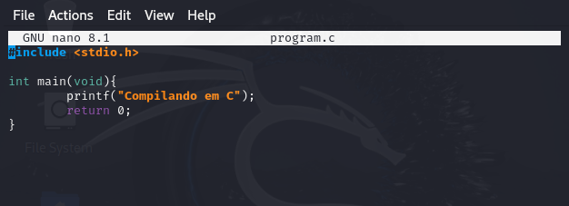
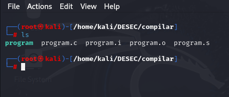
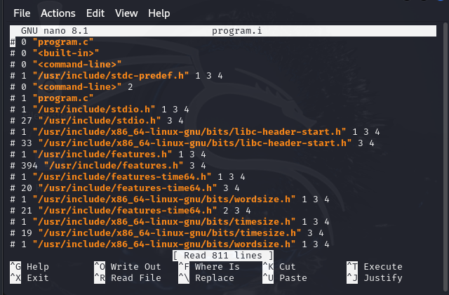
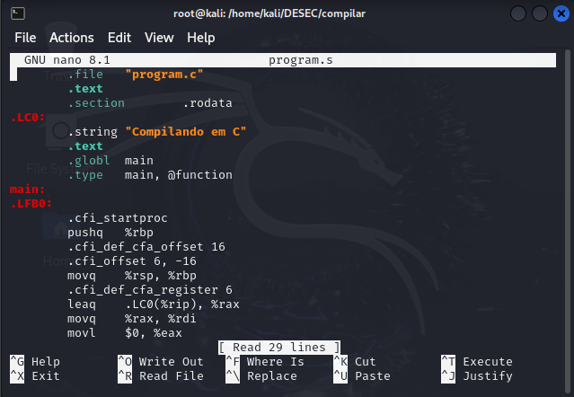
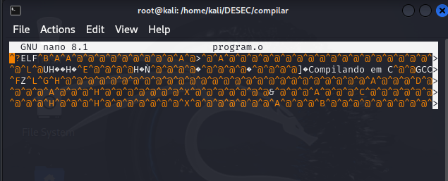
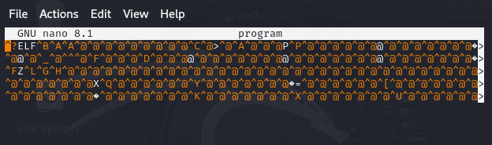

# O Processo de Compilação em C

O Compilador converte o programa em C em um executável. 

As fases da compilação:

1º Pré-Processamento: Remove comentários, inclui os arquivos necessários (.i).

2º Compilação: O .i é compilado e gerado o .s que contém instruções em Assembly.

3º Assembly: O .s é usado para gerar um .o contendo apenas o código em linguagem de máquina.

4° Linking: É feito a ligação do objeto com as bibliotecas para gerar o executável final.

Gerar as fases da compilação:

-> gcc --save--temps program.c -o program

